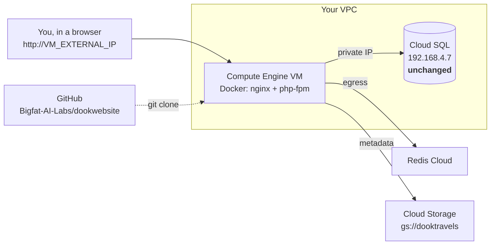

# Hosting dookwebsite on Google Cloud Platform

Step-by-step, from the current state of this repo to a running site you can
open in a browser and check by hand.

**Your four constraints, and how each is met:**

| # | Constraint | How |
|---|---|---|
| 1 | Code stays on GitHub | The VM clones `Bigfat-AI-Labs/dookwebsite` and builds there. No image registry needed. |
| 2 | Database unchanged | The VM is placed in the **same VPC** as Cloud SQL, so `DB_HOST=192.168.4.7` keeps working exactly as it does now. Nothing about the database changes. |
| 3 | Must use Docker | One container (nginx + php-fpm), built from the `Dockerfile` in this repo. |
| 4 | Default URL, not the custom domain | You browse `http://<VM_EXTERNAL_IP>`. DNS is untouched, the live site keeps serving, and you switch over only when you're satisfied. |

## What you end up with



The live site on the custom domain is **not touched at any point** in this
guide.

---

# Phase 0 — Push the code to GitHub

**Nothing from the recent work is committed yet.** The VM clones from
GitHub, so if you skip this it will build the old code without the Docker
setup, the query fixes, or the index migrations.

Check what is outstanding:

```bash
git status --short
```

You should see the Docker files, three migrations, `explainers/`, and
modified controllers plus `Helper.php`.

```bash
git checkout -b gcp-deploy

git add Dockerfile docker-compose.yml docker-compose.prod.yml .dockerignore \
        docker/ DOCKER.md explainers/ \
        database/migrations/2026_08_22_*.php \
        app/ config/database.php composer.json composer.lock

git commit -m "Docker setup for GCP, query optimisation, index migrations"
git push -u origin gcp-deploy
```

> **Check before you push:** `git status` must not show `.env`,
> `.env.docker`, or `application-project-dook-int-*.json`. All three are in
> `.gitignore` and must stay out of the repo. Confirm with
> `git ls-files | grep -E "^\.env|\.json$" | grep -v composer` — it should
> return nothing but `package.json`-style files.

Secrets reach the VM separately, in Phase 4.

---

# Phase 1 — GCP project setup

Set your values once:

```bash
export PROJECT=<your-project-id>
export REGION=<region>        # same region as Cloud SQL
export ZONE=<region>-a
gcloud config set project $PROJECT
```

### 1.1 Find the VPC your Cloud SQL instance is on

The VM must join this network or the private IP will not resolve.

```bash
gcloud sql instances list
gcloud sql instances describe <INSTANCE_NAME> \
    --format="value(settings.ipConfiguration.privateNetwork, ipAddresses[].ipAddress, region)"
```

Note the network name (e.g. `projects/<PROJECT>/global/networks/default`)
and confirm the private IP shown is `192.168.4.7`.

```bash
export VPC=<network-name>
export SUBNET=<subnet-in-that-region>
```

### 1.2 Enable APIs

```bash
gcloud services enable compute.googleapis.com \
    iamcredentials.googleapis.com \
    logging.googleapis.com
```

`iamcredentials` is **not optional** — it is what signs Cloud Storage URLs.

### 1.3 Service account for the VM

```bash
gcloud iam service-accounts create dookwebsite-vm --display-name "dookwebsite VM"
export SA=dookwebsite-vm@$PROJECT.iam.gserviceaccount.com
```

```bash
# Read the images bucket.
#
# Note the bucket name: GOOGLE_CLOUD_STORAGE_BUCKET is "dooktravels/com",
# which is not a legal bucket name - buckets cannot contain '/'. It works
# because the client concatenates it into the object path, so the real
# bucket is "dooktravels" and "com" is a folder inside it. Verified from a
# generated signed URL: storage.googleapis.com/dooktravels/com/poi/...
gcloud storage buckets add-iam-policy-binding gs://dooktravels \
    --member "serviceAccount:$SA" --role roles/storage.objectViewer

# Sign URLs as itself.
gcloud iam service-accounts add-iam-policy-binding $SA \
    --member "serviceAccount:$SA" --role roles/iam.serviceAccountTokenCreator

# Write container logs to Cloud Logging.
gcloud projects add-iam-policy-binding $PROJECT \
    --member "serviceAccount:$SA" --role roles/logging.logWriter
```

> **The `serviceAccountTokenCreator` binding is the one that breaks things
> silently if you skip it.** Signing a URL without a private key goes
> through the IAM Credentials API. Without this role `signedUrl()` throws,
> `generateSignedUrl()` catches the exception and returns `null`, and
> **every image on the site renders blank with nothing in any log.**
> Step 6.4 tests for exactly this.

---

# Phase 2 — Create the VM

```bash
gcloud compute instances create dookwebsite \
    --zone $ZONE \
    --machine-type e2-standard-2 \
    --image-family debian-12 --image-project debian-cloud \
    --boot-disk-size 50GB --boot-disk-type pd-balanced \
    --network $VPC --subnet $SUBNET \
    --service-account $SA \
    --scopes https://www.googleapis.com/auth/cloud-platform \
    --tags dookwebsite-http
```

Three things here matter:

- **`--network $VPC`** — this is what makes `192.168.4.7` reachable. Get it
  wrong and every page 500s on a database connection error.
- **`--scopes cloud-platform`** — the default scopes are too narrow for the
  Storage and IAM calls that sign image URLs.
- **An external IP is assigned by default.** You need it (that's your
  "default URL"), and it also gives the VM outbound internet access for
  the Agent Connect API, the blog API and Redis Cloud.

Get the address you will browse:

```bash
gcloud compute instances describe dookwebsite --zone $ZONE \
    --format="get(networkInterfaces[0].accessConfigs[0].natIP)"
```

Call it `VM_IP` from here on.

---

# Phase 3 — Firewall

While verifying, open port 80 to yourself only. Do not open it to the world
for a site that isn't checked yet.

```bash
MY_IP=$(curl -s https://ifconfig.me)

gcloud compute firewall-rules create allow-dookwebsite-http-testing \
    --network $VPC --allow tcp:80 \
    --source-ranges $MY_IP/32 \
    --target-tags dookwebsite-http \
    --description "Temporary: office/home IP only while verifying"
```

If your connection has a changing IP, re-run with the new address rather
than widening the range. Broaden it only when you go live.

---

# Phase 4 — Set up the VM

```bash
gcloud compute ssh dookwebsite --zone $ZONE
```

### 4.1 Docker

```bash
curl -fsSL https://get.docker.com | sudo sh
sudo usermod -aG docker $USER
exit
```

Reconnect so the group membership applies, then `docker ps` should work
without `sudo`.

### 4.2 Clone from GitHub

For a private repo, create a read-only deploy key on the VM:

```bash
ssh-keygen -t ed25519 -C "dookwebsite-vm" -f ~/.ssh/id_ed25519 -N ""
cat ~/.ssh/id_ed25519.pub
```

Add that public key at **GitHub → repo → Settings → Deploy keys → Add deploy
key**, leaving "Allow write access" **unchecked**.

```bash
sudo mkdir -p /opt/dookwebsite
sudo chown $USER:$USER /opt/dookwebsite
git clone -b gcp-deploy git@github.com:Bigfat-AI-Labs/dookwebsite.git /opt/dookwebsite
cd /opt/dookwebsite
```

### 4.3 Environment file

`.env` is gitignored, so it is not in the clone — this is deliberate.

```bash
sudo mkdir -p /etc/dookwebsite
sudo cp docker/env.gcp.example /etc/dookwebsite/app.env
sudo chmod 600 /etc/dookwebsite/app.env
sudo nano /etc/dookwebsite/app.env
```

Fill in every `REPLACE_ME`, copying the database, Redis and mail values from
your current `.env`. **Four settings are specific to IP-based verification
and will cause silent, confusing failures if you get them wrong:**

| Setting | Value now | Why |
|---|---|---|
| `APP_URL` | `http://VM_IP` | Every absolute link and asset URL is built from this. Set to the custom domain and your test page loads the **live site's** CSS/JS. |
| `ASSET_URL` | `http://VM_IP` | Same. |
| `SESSION_DOMAIN` | *(empty)* | A cookie scoped to `.dooktravels.com` is **not set at all** when the host is an IP. Login and booking appear broken with no error anywhere. |
| `GOOGLE_CLOUD_KEY_FILE` | *(absent — do not add it)* | Leaving it unset makes the app fall through to the VM's service account. Pointing it at a non-existent path blanks every image. |

Generate an app key if you are not reusing the existing one:

```bash
docker run --rm -v /opt/dookwebsite:/app -w /app php:8.2-cli php artisan key:generate --show
```

Log directory owned by the container's `www-data` (uid 33):

```bash
sudo mkdir -p /var/lib/dookwebsite/storage-logs
sudo chown -R 33:33 /var/lib/dookwebsite/storage-logs
```

---

# Phase 5 — Build and start

```bash
cd /opt/dookwebsite
docker compose -f docker-compose.prod.yml build      # a few minutes
docker compose -f docker-compose.prod.yml up -d
docker compose -f docker-compose.prod.yml logs -f app
```

Watch the entrypoint output. This is the expected shape:

```
[entrypoint] Clearing stale bootstrap caches copied in from the host...
[entrypoint] Linking storage (idempotent)...
[entrypoint] Discovering packages...
[entrypoint] GCS auth: Application Default Credentials as dookwebsite-vm@...
[entrypoint]           (that account needs roles/iam.serviceAccountTokenCreator on itself to sign URLs)
[entrypoint] Caching config/views...
[entrypoint] Ready. Starting: /usr/bin/supervisord ...
```

Two things to read carefully:

- **`GCS auth: Application Default Credentials as ...`** — if you instead
  see `WARNING: no GOOGLE_CLOUD_KEY_FILE and no GCE metadata server
  reachable`, images will not render. Check `--scopes` on the VM.
- **`Caching config/views`** — *not* "config/routes/views". `route:cache` is
  deliberately absent; see the warning at the end of this guide.

Start at boot:

```bash
sudo cp docker/dookwebsite.service /etc/systemd/system/
sudo systemctl daemon-reload
sudo systemctl enable --now dookwebsite
sudo systemctl status dookwebsite
```

---

# Phase 6 — Verify by hand

This is the part you said you wanted before touching DNS. Run all of it.
Everything below is from your own machine or an SSH session on the VM.

Shorthand used below:

```bash
DC="docker compose -f /opt/dookwebsite/docker-compose.prod.yml"
```

### 6.1 The container is healthy

```bash
$DC ps                        # State should be "running (healthy)"
curl -fsS http://localhost/up # 200
```

### 6.2 Cloud SQL over the private IP — unchanged

```bash
$DC exec app php artisan tinker --execute="echo DB::table('destinations')->count();"
```

A number means the VPC placement is right. A connection error means the VM
is on the wrong network — fix Phase 2 rather than changing anything about
the database.

### 6.3 Redis

```bash
$DC exec app php artisan tinker --execute="Cache::put('probe',1,10); var_dump(Cache::get('probe'));"
```

Expect `int(1)`. `NULL` means the cache is not reachable — the site still
works (it falls back to the database) but slower.

### 6.4 Signed image URLs — the silent failure

```bash
$DC exec app php artisan tinker --execute="var_dump(generateSignedUrl('poi/sample.jpg'));"
```

A long `https://storage.googleapis.com/dooktravels/com/...` URL means it
works. **`NULL` means the `roles/iam.serviceAccountTokenCreator` binding
from step 1.3 is missing** and every image on the site will be blank.

### 6.5 Routing is not frozen

```bash
$DC exec app ls bootstrap/cache/      # must NOT contain routes-v7.php
$DC exec app php artisan route:list --path="{slug}"
```

### 6.6 Pages, in a real browser

Open `http://VM_IP` and click through. Check each of these and confirm
**images actually appear**, not just that the page returns 200:

| Page | URL | What to confirm |
|---|---|---|
| Homepage | `http://VM_IP/` | Layout, mega menu, images |
| POI detail | `http://VM_IP/poi/presidential-residence/4` | Package cards, "N Tours" counts, inclusion icons |
| Attraction slug | `http://VM_IP/adventure-tours` | 200, correct content — **not** visa content |
| Destination | `http://VM_IP/destinations/almaty-tours` | Loads without bouncing to the homepage |
| Package detail | any tour card | Price, inclusions, itinerary |
| Search | site search | Results render |
| Booking / login | the booking flow | **Sessions persist** — this is what `SESSION_DOMAIN=` empty is for |
| Static assets | view page source | CSS/JS URLs point at `VM_IP`, not the live domain |

> **A 302 to the homepage is how this app reports *every* crash.**
> `bootstrap/app.php` renders all exceptions as a redirect, so a broken page
> looks like a bounce, not an error. If any page above bounces, get the real
> cause from the logs rather than assuming it is fine:
> ```bash
> $DC logs --tail=100 app
> $DC exec app tail -50 storage/logs/laravel-$(date +%Y-%m-%d).log
> ```

### 6.7 Compare against the live site

Open the same pages on the current production site side by side. You are
looking for missing images, missing prices, and differences in the package
cards.

---

# Phase 7 — Database migrations

Two **index-only** migrations are part of this work. They add indexes and
change no rows and no query results, but they do alter the shared database
that the live site is also using — so run them when you are ready, not
automatically at container start.

```bash
$DC exec app php artisan migrate \
  --path=database/migrations/2026_08_22_000001_add_indexes_to_poi_lookup_columns.php --force
$DC exec app php artisan migrate \
  --path=database/migrations/2026_08_22_000003_add_indexes_to_departure_card_columns.php --force
```

Both are safe to run against the live database and will speed the current
site up too.

- **`--path` is required.** A bare `php artisan migrate` fails: this
  database records the pre-Laravel-11 migration filenames, so a plain run
  tries to recreate tables that already exist.
- **Do not run `2026_08_22_000002`.** It adds a unique constraint that will
  make the external importer's plain `INSERT`s fail. Verify the importer
  uses `INSERT IGNORE`/upsert first.

---

# Redeploying a code change

```bash
# On your machine
git push origin gcp-deploy

# On the VM
cd /opt/dookwebsite
git pull
docker compose -f docker-compose.prod.yml build
docker compose -f docker-compose.prod.yml up -d
```

**Rollback:**

```bash
cd /opt/dookwebsite
git checkout <previous-commit-sha>
docker compose -f docker-compose.prod.yml build
docker compose -f docker-compose.prod.yml up -d
```

Once you are past manual verification, move builds off the VM: push images
to Artifact Registry and set `IMAGE=` in `/etc/dookwebsite/deploy.env`.
`docker-compose.prod.yml` already supports that; see `DOCKER.md`.

---

# When you're ready to go live on the custom domain

Not part of this guide — do it only after Phase 6 passes. In order:

1. Put a **Google Cloud HTTP(S) Load Balancer** in front of the VM with a
   managed certificate, or terminate TLS on the VM with Caddy/Certbot.
2. **Set `TrustProxies` in `bootstrap/app.php`.** Behind a load balancer,
   Laravel must trust `X-Forwarded-Proto` or `url()`/`asset()` emit
   `http://` links on an `https://` page and browsers block them as mixed
   content. **This is an application change that has not been made** — this
   work was scoped to the Docker setup.
3. Update `/etc/dookwebsite/app.env`:
   `APP_URL` and `ASSET_URL` → `https://www.dooktravels.com`,
   `SESSION_DOMAIN` → `.dooktravels.com`.
4. Restart, re-run Phase 6 against the domain.
5. Widen the firewall rule from your IP to the load balancer ranges
   `130.211.0.0/22,35.191.0.0/16`.
6. Only then change DNS.

---

# Things that will bite you

**Never add `php artisan route:cache`.** `routes/web.php` queries the
database to decide which controller `/{slug}` maps to. Route caching
serialises that answer once, and during an artisan command there is no HTTP
request — so the fallback branch wins and `/{slug}` freezes to
`VisaController` for every request the container ever serves. Verified:

```
$ php artisan route:cache && php artisan route:list --path="{slug}"
GET|HEAD  {slug} ... frontend.get_visa_details › Frontend\VisaController@getVisaDetails
```

That breaks all 324 slugs that should route elsewhere, and because every
exception redirects to the homepage it fails as a silent 302. The line is
deliberately absent from `docker/entrypoint.sh`, with the reasoning in a
comment. See `redis_performance_report.md` issue 11.

**Every exception becomes a 302 to the homepage.** `bootstrap/app.php`
renders all `Throwable`s as `redirect()->route('frontend.index')`. During
this deployment that means a misconfiguration looks like a working
redirect. Read the logs, don't trust the status code. Fixing this is the
single highest-value change you can make to this codebase.

**`/book` (the legacy CodeIgniter sub-app) returns 500.** Its
`app/Config/Database.php` has blank credentials and `hostname => localhost`.
Pre-existing, unrelated to Docker, configured separately in production.

**`clear_env = no` in `docker/www.conf` is load-bearing.** The entrypoint
runs `config:cache`, after which Laravel stops reading `.env`, so the bare
`env()` calls in `Helper.php` resolve only from the worker's process
environment. Changing it to `yes` blanks every Cloud Storage URL.

---

# Verification status of this guide

- **Verified on the dev machine:** the image builds cleanly from this
  `Dockerfile`; the container starts and the entrypoint's credential
  detection reports the correct path; `route:cache` freezing `/{slug}` was
  reproduced and then cleared; the real bucket name was confirmed from a
  generated signed URL.
- **Not verified:** every `gcloud` command here. There is no GCP project
  access from the dev machine, so Phases 1–5 are written from the documented
  behaviour of those services and have not been executed. **Phase 6 is the
  real acceptance test** — treat it as such rather than a formality.
