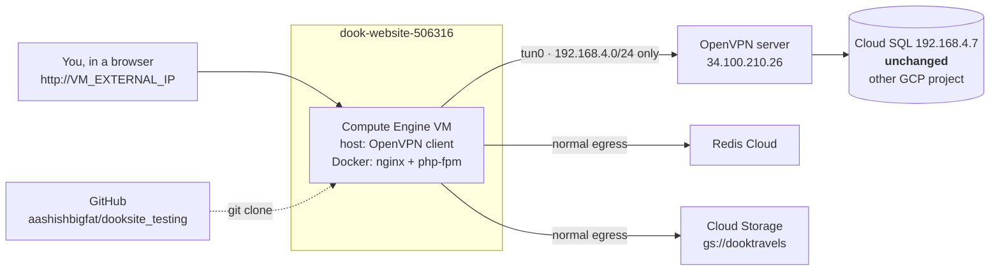

# Hosting dookwebsite on Google Cloud Platform

Step-by-step, from the current state of this repo to a running site you can
open in a browser and check by hand.

**Your four constraints, and how each is met:**

| # | Constraint | How |
|---|---|---|
| 1 | Code stays on GitHub | The VM clones `aashishbigfat/dooksite_testing` and builds there. No image registry needed. |
| 2 | Database unchanged | The VM runs an **OpenVPN client** to the same tunnel your laptop uses, so `DB_HOST=192.168.4.7` keeps working exactly as it does now. Nothing about the database changes. |
| 3 | Must use Docker | One container (nginx + php-fpm), built from the `Dockerfile` in this repo. |
| 4 | Default URL, not the custom domain | You browse `http://<VM_EXTERNAL_IP>`. DNS is untouched, the live site keeps serving, and you switch over only when you're satisfied. |

## How the database is reached — read this first

`192.168.4.7` is **not** a private IP your VM's network can route to. It sits
behind an OpenVPN tunnel, in a GCP project this account cannot administer.
Established by investigation, not assumption:

| Finding | Evidence |
|---|---|
| `192.168.4.0/24` goes through an **OpenVPN tunnel**, not a VPC route | `Find-NetRoute 192.168.4.7` → next hop `172.27.232.1` on the OpenVPN TAP adapter |
| The tunnel ends on a **GCE VM** | Profile says `remote 34.100.210.26`; PTR is `26.210.100.34.bc.googleusercontent.com` |
| That project is **not administrable** by `aashish@bigfatailabs.com` | `gcloud sql instances list --project application-project-dook-int` → "client is not authorized" |
| The deployment project is separate | `dook-website-506316` is a fresh project; the database's VPC is not reachable from it |
| The profile is **split tunnel** | No `redirect-gateway` — only pushed routes use the VPN |

> **VPC Peering is not a workaround.** Cloud SQL private IPs live behind
> Google's Private Service Access network, and VPC peering is not transitive.
> Peering `dook-website-506316` to the database's VPC still would not reach
> `192.168.4.7`. Don't spend a day on it.

So the VM does what your laptop does: **runs an OpenVPN client**. The tunnel
lives on the VM host, and Docker containers reach the database through
ordinary NAT — the application needs no VPN awareness and `DB_HOST` is
unchanged.



Split tunnel is what makes this practical: only `192.168.4.0/24` crosses the
VPN, so GitHub, Redis Cloud and Cloud Storage keep using the VM's normal
internet path.

**The trade-off you are accepting:** the tunnel becomes a hard dependency. If
it drops, the app cannot reach the database — and because `bootstrap/app.php`
turns every exception into a 302 to the homepage, that outage *looks like a
working redirect*. Phase 5 installs a healthcheck precisely because nothing
else will tell you.

The live site on the custom domain is **not touched at any point** in this
guide.

---

# Phase 0 — Confirm the code on GitHub

**Already done.** Verified against
`https://github.com/aashishbigfat/dooksite_testing` on branch `main`:

| Check | Result |
|---|---|
| `Dockerfile`, `docker-compose.prod.yml`, `docker/*` present | ✅ |
| `docker/entrypoint.sh` — `route:cache` appears only in comments, live commands are `config:cache` + `view:cache` | ✅ |
| `app/Http/Helper/Helper.php` contains `departureCardData` (the query fixes) | ✅ |
| Index migrations `2026_08_22_000001` / `000003` present | ✅ |
| `.env`, `.env.docker`, `application-project-dook-int-*.json` | ✅ absent — correct |

Nothing to do here. If you push further changes, re-check that last row —
the repo is public.

Secrets never go in the repo; they reach the VM separately, in Phase 4.4.

---

# Phases 1–3 — GCP setup ✅ ALREADY DONE

These were executed on 2026-08-22. Recorded here for reference; you do not
need to run them again.

| Resource | Value |
|---|---|
| Project | `dook-website-506316` (project number `691168319637`) |
| Billing | enabled, account `010DB1-CF1341-2E10F7` |
| Your role | `roles/editor` |
| APIs enabled | `compute`, `iamcredentials`, `logging` |
| VM | `dookwebsite`, `e2-standard-2`, Debian 12, 50 GB pd-balanced |
| Zone | `asia-south1-a` (same region as the VPN server) |
| **External IP** | **`34.93.38.228`** ← this is your "default URL" |
| Internal IP | `10.160.0.2` |
| Service account | `691168319637-compute@developer.gserviceaccount.com` (default, has `roles/editor`) |
| Firewall | `allow-dookwebsite-http-testing` — tcp:80 from `223.181.33.202/32` only |

The VM was created with `--can-ip-forward` (needed for the VPN tunnel) and
`--scopes cloud-platform`.

### Why there is no custom service account

The plan called for one with `storage.objectViewer` and
`iam.serviceAccountTokenCreator`. That turned out to be impossible **and
unnecessary**:

- **Impossible:** `gs://dooktravels` belongs to `application-project-dook-int`.
  `gcloud storage buckets describe gs://dooktravels` → *"does not have
  storage.buckets.get access"*. You cannot grant a new service account
  access to a bucket you cannot administer. And a signed URL is validated
  against the **signer's** permissions, so such an account would produce
  URLs that return 403.
- **Unnecessary:** the default Compute Engine service account already holds
  `roles/editor`, which covers writing logs — and `roles/editor` cannot
  grant IAM roles anyway, so the bindings would have failed.

**So Cloud Storage uses the existing JSON key** (Phase 4.5), which already
has the right permissions on that bucket. To move to the cleaner model
later, ask whoever administers `application-project-dook-int` for
`roles/storage.objectViewer` on the bucket plus
`roles/iam.serviceAccountTokenCreator` on the service account itself, then
drop `GOOGLE_CLOUD_KEY_FILE` from the env file.

### Connect to the VM

```bash
gcloud config set project dook-website-506316
gcloud compute ssh dookwebsite --zone asia-south1-a
```

---

# Phase 4 — Set up the VM

```bash
gcloud compute ssh dookwebsite --zone $ZONE
```

### 4.1 The VPN tunnel — do this before anything else

Nothing downstream works until `192.168.4.7` is reachable. The app queries
the database during startup (`artisan package:discover` in the entrypoint
resolves a DB query in this codebase), so the container cannot even boot
without it.

```bash
sudo apt-get update && sudo apt-get install -y openvpn netcat-openbsd
```

**Get the profile onto the VM.** Either download a fresh one from the
OpenVPN Access Server web UI using your URL/username/password, or copy the
one from this laptop at
`%APPDATA%\OpenVPN Connect\profiles\bundled.ovpn`. It must land at
`/etc/openvpn/client/dook.conf` — `openvpn-client@dook` derives that path
from the unit name, and the `.conf` extension is required.

```bash
sudo install -d -m 700 /etc/openvpn/client
sudo nano /etc/openvpn/client/dook.conf     # paste the profile
sudo chmod 600 /etc/openvpn/client/dook.conf
```

**Handle authentication.** The profile carries an inline client certificate
*and* an `auth-user-pass` directive, so it also wants a username and
password. Left as-is, OpenVPN prompts on the console and the service never
starts. There are two ways to fix that.

**Preferred — an autologin profile.** The server at `34.100.210.26` is
OpenVPN **Access Server** (its web root redirects to `/__session_start__`).
Access Server can issue a profile for a user with *Allow Auto-login* set,
which embeds everything needed and prompts for nothing — no password on
disk at all. In the Admin UI:

> User Permissions → add `dookwebsite-vm` → tick **Allow Auto-login** → Save
> → download that user's **autologin** profile.

Use that as `/etc/openvpn/client/dook.conf` and skip the rest of this step.
It is both simpler and safer than the fallback below.

**Fallback — a stored credentials file**, if you can't get an autologin
profile:

Type the password into an editor, not the command line — a heredoc or an
`echo` puts your VPN password in the shell history and in the process list.

```bash
sudo install -m 600 /dev/null /etc/openvpn/client/dook.auth
sudo nano /etc/openvpn/client/dook.auth
#   line 1: the VPN username
#   line 2: the VPN password
#   nothing else - no blank third line

# Point the directive at that file.
sudo sed -i 's|^auth-user-pass$|auth-user-pass /etc/openvpn/client/dook.auth|' \
    /etc/openvpn/client/dook.conf
grep '^auth-user-pass' /etc/openvpn/client/dook.conf   # confirm it now has the path
```

**Start it, and make it restart on its own:**

```bash
sudo systemctl enable --now openvpn-client@dook

sudo mkdir -p /etc/systemd/system/openvpn-client@dook.service.d
sudo cp /opt/dookwebsite/docker/openvpn-client-override.conf \
        /etc/systemd/system/openvpn-client@dook.service.d/override.conf
sudo systemctl daemon-reload
sudo systemctl restart openvpn-client@dook
```

*(If you haven't cloned the repo yet, do Phase 4.3 first and come back for
the override — it is a two-line file.)*

**Verify all four before continuing. Do not skip ahead if any fail:**

```bash
systemctl is-active openvpn-client@dook     # active
ip addr show tun0                           # interface exists, has an IP
ip route get 192.168.4.7                    # MUST say "dev tun0"
nc -vz 192.168.4.7 3306                     # succeeded
```

`ip route get` is the one people skip and regret. The tunnel can be up while
the route was never pushed, in which case database traffic leaves via the
default gateway and vanishes.

**Check for a subnet clash** — Docker's bridge is `172.17.0.0/16` and the VPN
client pool is around `172.27.232.0/2x`. No overlap today, but confirm:

```bash
ip route | grep -E "172\.(1[6-9]|2[0-9])\."
```

> **Use a separate VPN account for the server — don't share yours.**
> Access Server defaults to one concurrent session per user (`duplicate_cn`
> off), so a shared account means the VM and your laptop disconnect each
> other. That shows up as a flapping tunnel in
> `journalctl -u openvpn-client@dook -f`.
>
> Even where multiple sessions are permitted, a dedicated account is worth
> it: it can be revoked without touching your access, it survives your
> password changing, your personal credentials never sit on a server, and
> the server's sessions are distinguishable in the AS logs.
>
> If your URL/username/password are **admin** credentials you can create the
> account yourself at `https://34.100.210.26/admin`. If not, ask whoever
> administers it for a `dookwebsite-vm` user with auto-login enabled.

### 4.2 Docker

```bash
curl -fsSL https://get.docker.com | sudo sh
sudo usermod -aG docker $USER
exit
```

Reconnect so the group membership applies, then `docker ps` should work
without `sudo`.

### 4.3 Clone from GitHub

`aashishbigfat/dooksite_testing` is a **public** repo, so no deploy key or
token is needed — a plain HTTPS clone works:

```bash
sudo mkdir -p /opt/dookwebsite
sudo chown $USER:$USER /opt/dookwebsite
git clone https://github.com/aashishbigfat/dooksite_testing.git /opt/dookwebsite
cd /opt/dookwebsite
```

> **Because the repo is public, never commit `.env`, `.env.docker` or the
> Google Cloud key JSON to it.** Verified on the current `main`: all three
> are absent and only `.env.example` is present, which is correct. Keep it
> that way — a leaked service-account key or database password in a public
> repo is exploitable within minutes.
>
> If you later make the repo private, switch to a read-only **deploy key**:
> `ssh-keygen -t ed25519 -f ~/.ssh/id_ed25519 -N ""`, add the `.pub` under
> repo → Settings → Deploy keys with write access **unchecked**, and clone
> via `git@github.com:...` instead.

### 4.4 Environment file

`.env` is gitignored, so it is not in the clone — this is deliberate.

```bash
sudo mkdir -p /etc/dookwebsite
sudo cp docker/env.gcp.example /etc/dookwebsite/app.env
sudo chmod 600 /etc/dookwebsite/app.env
sudo nano /etc/dookwebsite/app.env
```

Fill in every `REPLACE_ME`, copying the database, Redis and mail values from
your current `.env`. **Four settings are specific to IP-based verification
and will cause silent, confusing failures if you get them wrong:**

| Setting | Value now | Why |
|---|---|---|
| `APP_URL` | `http://34.93.38.228` | Every absolute link and asset URL is built from this. Set to the custom domain and your test page loads the **live site's** CSS/JS. |
| `ASSET_URL` | `http://34.93.38.228` | Same. |
| `SESSION_DOMAIN` | *(empty)* | A cookie scoped to `.dooktravels.com` is **not set at all** when the host is an IP. Login and booking appear broken with no error anywhere. |
| `GOOGLE_CLOUD_KEY_FILE` | `/etc/dookwebsite/gcs-key.json` | Must point at the JSON key you upload in 4.4a. The bucket is in another project, so the VM's own service account cannot be used. A wrong path blanks every image. |

Generate an app key if you are not reusing the existing one:

```bash
docker run --rm -v /opt/dookwebsite:/app -w /app php:8.2-cli php artisan key:generate --show
```

Log directory owned by the container's `www-data` (uid 33):

```bash
sudo mkdir -p /var/lib/dookwebsite/storage-logs
sudo chown -R 33:33 /var/lib/dookwebsite/storage-logs
```

### 4.5 Google Cloud Storage key

Every image on the site is served through a signed URL, and signing needs
credentials with read access to `gs://dooktravels`. That bucket is in
`application-project-dook-int`, which this account cannot administer — so
the VM's own service account cannot be granted access, and the existing JSON
key is used instead.

From **your laptop** (PowerShell), copy the key that already works:

```powershell
gcloud compute scp `
  "$HOME\Desktop\dooksite\dookwebsite\application-project-dook-int-9801963164ab.json" `
  dookwebsite:~/gcs-key.json --zone asia-south1-a
```

Then on the VM:

```bash
sudo mv ~/gcs-key.json /etc/dookwebsite/gcs-key.json
# Owned by www-data (uid 33 on Debian, matching the container), not root.
# php-fpm's MASTER process runs as root, but the WORKER processes that
# actually handle requests run as www-data (docker/www.conf). A root-owned
# key is unreadable to them - confirmed by hitting this exact bug during
# deployment: every page that renders an image logged
# "file_get_contents(...gcs-key.json): Permission denied" and 302'd to the
# homepage (via bootstrap/app.php's catch-all), while `docker compose exec`
# tests still passed because exec runs as root and could read it anyway.
sudo chown 33:33 /etc/dookwebsite/gcs-key.json
sudo chmod 400 /etc/dookwebsite/gcs-key.json
```

`docker-compose.prod.yml` mounts it read-only at the same path inside the
container, matching `GOOGLE_CLOUD_KEY_FILE` in the env file. It is excluded
by `.dockerignore` and `.gitignore`, so it never reaches an image layer or
the public repo — keep it that way.

> This is the one place this deployment holds a long-lived private key. It is
> a consequence of not administering the bucket's project, not a preference.
> Step 6.5 verifies it works; the note in Phases 1–3 explains how to remove
> the need for it.

---

# Phase 5 — Build and start

```bash
cd /opt/dookwebsite
docker compose -f docker-compose.prod.yml build      # a few minutes
docker compose -f docker-compose.prod.yml up -d
docker compose -f docker-compose.prod.yml logs -f app
```

Watch the entrypoint output. This is the expected shape:

```
[entrypoint] Clearing stale bootstrap caches copied in from the host...
[entrypoint] Linking storage (idempotent)...
[entrypoint] Discovering packages...
[entrypoint] GCS auth: key file at /etc/dookwebsite/gcs-key.json
[entrypoint] Caching config/views...
[entrypoint] Ready. Starting: /usr/bin/supervisord ...
```

Two things to read carefully:

- **`GCS auth: key file at /etc/dookwebsite/gcs-key.json`** — if you instead
  see `WARNING: GOOGLE_CLOUD_KEY_FILE is set ... but that path is not
  readable`, the key did not get uploaded (Phase 4.5) or the mount is
  missing, and every image will be blank.
- **`Caching config/views`** — *not* "config/routes/views". `route:cache` is
  deliberately absent; see the warning at the end of this guide.

Start at boot:

```bash
sudo cp docker/dookwebsite.service /etc/systemd/system/
sudo systemctl daemon-reload
sudo systemctl enable --now dookwebsite
sudo systemctl status dookwebsite
```

The unit declares `Requires=` and `After=openvpn-client@dook.service`, so on
every reboot the tunnel comes up before the container tries to reach the
database.

### 5.1 Tunnel monitoring — not optional

systemd only knows whether the openvpn *process* is alive. A tunnel can be up,
the interface present and the process healthy, while no traffic passes — a
stale session after a server restart, a revoked seat, a route that was never
pushed. systemd is satisfied; your site is down.

And it is down invisibly: the app can't reach the database, Laravel throws,
and `bootstrap/app.php` turns that into a 302 to the homepage. **The site
looks like it is working.** This timer is what notices.

```bash
sudo install -m 755 docker/vpn-healthcheck.sh /usr/local/bin/vpn-healthcheck
sudo cp docker/dookwebsite-vpn-healthcheck.service \
        docker/dookwebsite-vpn-healthcheck.timer /etc/systemd/system/
sudo systemctl daemon-reload
sudo systemctl enable --now dookwebsite-vpn-healthcheck.timer
```

It checks every minute that `tun0` exists, that `192.168.4.7` still routes
through it, and that port 3306 actually answers — restarting the tunnel if
not, and logging either way.

```bash
systemctl list-timers dookwebsite-vpn-healthcheck.timer
journalctl -t vpn-healthcheck -f
sudo /usr/local/bin/vpn-healthcheck && echo "healthy"   # run once by hand
```

---

# Phase 6 — Verify by hand

This is the part you said you wanted before touching DNS. Run all of it.
Everything below is from your own machine or an SSH session on the VM.

Shorthand used below:

```bash
DC="docker compose -f /opt/dookwebsite/docker-compose.prod.yml"
```

### 6.1 The container is healthy

```bash
$DC ps                        # State should be "running (healthy)"
curl -fsS http://localhost/up # 200
```

### 6.2 The tunnel, from the host

```bash
systemctl is-active openvpn-client@dook   # active
ip route get 192.168.4.7                  # dev tun0
nc -vz 192.168.4.7 3306                   # succeeded
```

### 6.3 The database, from inside the container — the decisive test

```bash
$DC exec app php artisan tinker --execute="echo DB::table('destinations')->count();"
```

A number proves the whole approach works: traffic left the container, was
NAT'd by the host, crossed the tunnel and reached Cloud SQL. **This is the
step that validates the architecture** — 6.2 only proves the host can do it.

A connection error here while 6.2 passes means Docker's NAT isn't reaching
`tun0`. Check for a subnet clash (`ip route | grep 172.`) rather than
changing anything about the database.

### 6.4 Redis

```bash
$DC exec app php artisan tinker --execute="Cache::put('probe',1,10); var_dump(Cache::get('probe'));"
```

Expect `int(1)`. `NULL` means the cache is not reachable — the site still
works (it falls back to the database) but slower.

### 6.5 Signed image URLs — the silent failure

```bash
$DC exec app php artisan tinker --execute="var_dump(generateSignedUrl('poi/sample.jpg'));"
```

A long `https://storage.googleapis.com/dooktravels/com/...` URL means it
works. **`NULL` means the `roles/iam.serviceAccountTokenCreator` binding
from step 1.3 is missing** and every image on the site will be blank.

### 6.6 Routing is not frozen

```bash
$DC exec app ls bootstrap/cache/      # must NOT contain routes-v7.php
$DC exec app php artisan route:list --path="{slug}"
```

### 6.7 Pages, in a real browser

Open `http://34.93.38.228` and click through. Check each of these and confirm
**images actually appear**, not just that the page returns 200:

| Page | URL | What to confirm |
|---|---|---|
| Homepage | `http://34.93.38.228/` | Layout, mega menu, images |
| POI detail | `http://34.93.38.228/poi/presidential-residence/4` | Package cards, "N Tours" counts, inclusion icons |
| Attraction slug | `http://34.93.38.228/adventure-tours` | 200, correct content — **not** visa content |
| Destination | `http://34.93.38.228/destinations/almaty-tours` | Loads without bouncing to the homepage |
| Package detail | any tour card | Price, inclusions, itinerary |
| Search | site search | Results render |
| Booking / login | the booking flow | **Sessions persist** — this is what `SESSION_DOMAIN=` empty is for |
| Static assets | view page source | CSS/JS URLs point at `34.93.38.228`, not the live domain |

> **A 302 to the homepage is how this app reports *every* crash.**
> `bootstrap/app.php` renders all exceptions as a redirect, so a broken page
> looks like a bounce, not an error. If any page above bounces, get the real
> cause from the logs rather than assuming it is fine:
> ```bash
> $DC logs --tail=100 app
> $DC exec app tail -50 storage/logs/laravel-$(date +%Y-%m-%d).log
> ```

### 6.8 Break the tunnel on purpose

Do this once, deliberately, so you know what an outage looks like *before*
it happens unplanned at 2am.

```bash
sudo systemctl stop openvpn-client@dook
curl -sI http://localhost/ | head -1        # expect 302, NOT an error
journalctl -t vpn-healthcheck -f            # within a minute: UNHEALTHY, restarting
```

Two things to take away. First, a dead database presents as a **302 to the
homepage** — the site looks alive. Second, the healthcheck should restart the
tunnel and log `RECOVERED` on its own. If it doesn't, fix that now, because
this is the failure mode you are most likely to actually hit.

```bash
sudo systemctl start openvpn-client@dook    # if it hasn't already recovered
```

### 6.9 Compare against the live site

Open the same pages on the current production site side by side. You are
looking for missing images, missing prices, and differences in the package
cards.

---

# Phase 7 — Database migrations

Two **index-only** migrations are part of this work. They add indexes and
change no rows and no query results, but they do alter the shared database
that the live site is also using — so run them when you are ready, not
automatically at container start.

```bash
$DC exec app php artisan migrate \
  --path=database/migrations/2026_08_22_000001_add_indexes_to_poi_lookup_columns.php --force
$DC exec app php artisan migrate \
  --path=database/migrations/2026_08_22_000003_add_indexes_to_departure_card_columns.php --force
```

Both are safe to run against the live database and will speed the current
site up too.

- **`--path` is required.** A bare `php artisan migrate` fails: this
  database records the pre-Laravel-11 migration filenames, so a plain run
  tries to recreate tables that already exist.
- **Do not run `2026_08_22_000002`.** It adds a unique constraint that will
  make the external importer's plain `INSERT`s fail. Verify the importer
  uses `INSERT IGNORE`/upsert first.

---

# Redeploying a code change

```bash
# On your machine
git push origin main

# On the VM
cd /opt/dookwebsite
git pull
docker compose -f docker-compose.prod.yml build
docker compose -f docker-compose.prod.yml up -d
```

**Rollback:**

```bash
cd /opt/dookwebsite
git checkout <previous-commit-sha>
docker compose -f docker-compose.prod.yml build
docker compose -f docker-compose.prod.yml up -d
```

Once you are past manual verification, move builds off the VM: push images
to Artifact Registry and set `IMAGE=` in `/etc/dookwebsite/deploy.env`.
`docker-compose.prod.yml` already supports that; see `DOCKER.md`.

---

# HTTPS on the verification domain ✅ DONE (2026-08-24)

The site is reachable at **`https://dook.bigfat.ai`** with a real,
browser-trusted certificate. This is a **separate verification domain**,
not `dooktravels.com` — it doesn't touch the live site or its DNS, and
exists purely so testers get a normal padlock instead of a bare-IP
"Not Secure" warning while this deployment is being checked by hand.

**Why a domain was required at all:** no public certificate authority —
not Let's Encrypt, not Google's own managed certs — will issue a trusted
certificate for a bare IP address. `dook.bigfat.ai` already existed as a
subdomain of a domain the team controls and was pointed at `34.93.38.228`,
which sidestepped needing a throwaway free domain.

**Approach taken: Option A — TLS terminated by the container's own nginx**,
not a separate host-level proxy. This means Laravel sees genuine HTTPS
requests directly and needs **no `TrustProxies` change** — the trade-off
noted for Option B below does not apply here.

### What changed

| File | Change |
|---|---|
| `docker/nginx.conf` | Added an ACME-challenge location (`^~ /.well-known/acme-challenge/`), a `443 ssl` server block for `dook.bigfat.ai` with the cert paths, `fastcgi_param HTTPS on;` in both PHP locations (see below), and a port-80 redirect to the fixed HTTPS domain — not `https://$host`, because that would send bare-IP visitors to a hostname the certificate doesn't cover |
| `docker-compose.prod.yml` | Publishes `443:443`; mounts `/etc/letsencrypt` and a certbot webroot directory, both read-only |
| `/etc/dookwebsite/app.env` (VM only) | `APP_URL` / `ASSET_URL` → `https://dook.bigfat.ai` |
| Firewall `allow-dookwebsite-http-testing` | Widened from a single IP to `0.0.0.0/0` on ports 80 and 443 — required both for Let's Encrypt's validation servers to reach the ACME challenge and for any tester to reach the site at all |

**The `fastcgi_param HTTPS on;` line matters more than it looks.** nginx
does not automatically tell PHP a connection was encrypted. Without it,
`$request->secure()` reports `false` even on a genuinely HTTPS connection —
confirmed by checking asset URLs on the live homepage before and after
updating `app.env`: 46 `http://` references dropped to 1 (a `schema.org`
JSON-LD namespace string, not a loaded resource — expected and harmless).

### Certificate lifecycle

Issued via Certbot on the VM **host** (not inside the container) using
HTTP-01 webroot validation — `certbot certonly --webroot`. Renewal is
handled by Debian's own `certbot.timer` (runs twice daily, checks
expiry, only actually renews within 30 days of expiry). A deploy-hook at
`/etc/letsencrypt/renewal-hooks/deploy/reload-dookwebsite-nginx.sh` runs
`docker compose exec app nginx -s reload` after each renewal — necessary
because the container's already-running nginx process won't notice new
certificate files on its own, only the bind-mounted directory changing.

Verified with `certbot renew --dry-run` against the staging CA.

**Gotcha hit while testing this:** the SSH client's own local `timeout`
killing a `gcloud compute ssh` connection does **not** kill the remote
process — a certbot run cut off this way kept running server-side and held
the lock, making the *next* attempt fail with "Another instance of Certbot
is already running." If you see that error, check `ps aux | grep certbot`
on the VM for a genuinely orphaned process before assuming something is
broken.

Certificate: `CN=dook.bigfat.ai`, issued 2026-08-24, expires 2026-11-22.

---

# When you're ready to go live on the custom domain

Not part of this guide — do it only after Phase 6 passes. In order:

1. Put a **Google Cloud HTTP(S) Load Balancer** in front of the VM with a
   managed certificate, or terminate TLS on the VM with Caddy/Certbot.
2. **Set `TrustProxies` in `bootstrap/app.php`.** Behind a load balancer,
   Laravel must trust `X-Forwarded-Proto` or `url()`/`asset()` emit
   `http://` links on an `https://` page and browsers block them as mixed
   content. **This is an application change that has not been made** — this
   work was scoped to the Docker setup.
3. Update `/etc/dookwebsite/app.env`:
   `APP_URL` and `ASSET_URL` → `https://www.dooktravels.com`,
   `SESSION_DOMAIN` → `.dooktravels.com`.
4. Restart, re-run Phase 6 against the domain.
5. Widen the firewall rule from your IP to the load balancer ranges
   `130.211.0.0/22,35.191.0.0/16`.
6. Only then change DNS.

---

# Things that will bite you

**Never add `php artisan route:cache`.** `routes/web.php` queries the
database to decide which controller `/{slug}` maps to. Route caching
serialises that answer once, and during an artisan command there is no HTTP
request — so the fallback branch wins and `/{slug}` freezes to
`VisaController` for every request the container ever serves. Verified:

```
$ php artisan route:cache && php artisan route:list --path="{slug}"
GET|HEAD  {slug} ... frontend.get_visa_details › Frontend\VisaController@getVisaDetails
```

That breaks all 324 slugs that should route elsewhere, and because every
exception redirects to the homepage it fails as a silent 302. The line is
deliberately absent from `docker/entrypoint.sh`, with the reasoning in a
comment. See `redis_performance_report.md` issue 11.

**Every exception becomes a 302 to the homepage.** `bootstrap/app.php`
renders all `Throwable`s as `redirect()->route('frontend.index')`. During
this deployment that means a misconfiguration looks like a working
redirect. Read the logs, don't trust the status code. Fixing this is the
single highest-value change you can make to this codebase.

**The VPN tunnel is a single point of failure, and it fails silently.**
Combined with the item above, a dropped tunnel means every page 302s to the
homepage with nothing in the application log. `dookwebsite-vpn-healthcheck.timer`
exists solely to notice this. If you take one thing from this guide, take
that: `journalctl -t vpn-healthcheck` is where you look first when the site
behaves oddly.

**Watch for VPN session limits.** OpenVPN Access Server commonly permits one
concurrent session per user. If the VM and your laptop share an account they
will disconnect each other, which shows up as a flapping tunnel in
`journalctl -u openvpn-client@dook`. Request a dedicated VPN account for the
server.

**This is a workaround, not the destination.** Running a client VPN on a
server exists because this account cannot administer the project holding the
database. The durable fix is a VM inside that project's VPC, where
`192.168.4.7` is simply routable and none of this machinery is needed. Worth
revisiting before the custom-domain cutover.

**`/book` (the legacy CodeIgniter sub-app) returns 500.** Its
`app/Config/Database.php` has blank credentials and `hostname => localhost`.
Pre-existing, unrelated to Docker, configured separately in production.

**`clear_env = no` in `docker/www.conf` is load-bearing.** The entrypoint
runs `config:cache`, after which Laravel stops reading `.env`, so the bare
`env()` calls in `Helper.php` resolve only from the worker's process
environment. Changing it to `yes` blanks every Cloud Storage URL.

---

# Verification status of this guide

**Verified on the dev machine (Docker):** the image builds cleanly from this
`Dockerfile`; the container starts and the entrypoint's credential detection
reports the correct path; `route:cache` freezing `/{slug}` was reproduced and
then cleared; the real bucket name was confirmed from a generated signed URL.

**Verified for the VPN architecture:**

- `192.168.4.7` routes over the OpenVPN TAP adapter, next hop
  `172.27.232.1` — it is not a VPC route
- the profile's `remote` is `34.100.210.26`, whose PTR is
  `26.210.100.34.bc.googleusercontent.com` — a GCE VM
- `aashish@bigfatailabs.com` is denied `sql.instances.list`,
  `compute.networks.list` and `compute.subnetworks.list` on
  `application-project-dook-int`
- the original `dooksite` project had no billing; deployment moved to
  `dook-website-506316`, where billing is enabled and the account holds
  `roles/editor`
- the profile is split-tunnel (no `redirect-gateway`) and carries an inline
  client certificate *plus* an `auth-user-pass` directive

**Verified on GitHub:** `main` contains the Docker setup, both index
migrations and the query fixes, with no `.env` or credential JSON present.

**Not verified — nothing has been created on GCP yet.** Every `gcloud`
command in Phases 1–3, and the entire VPN-on-VM setup in Phase 4.1, are
written from documented behaviour and have **not** been executed. In
particular, whether Docker's NAT reaches `tun0` is argued from how bridge
networking works, not observed.

**Phase 6 is the real acceptance test, and 6.3 is the one that matters** —
it is what proves the architecture rather than merely the configuration.
