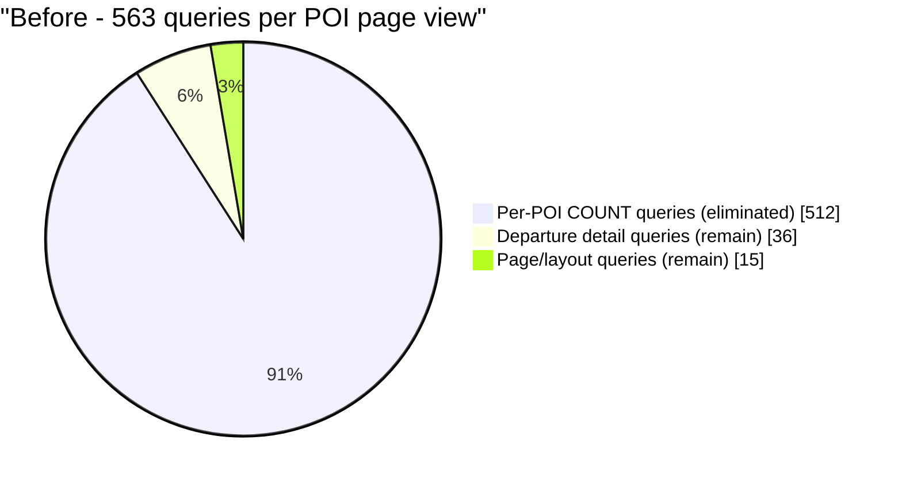
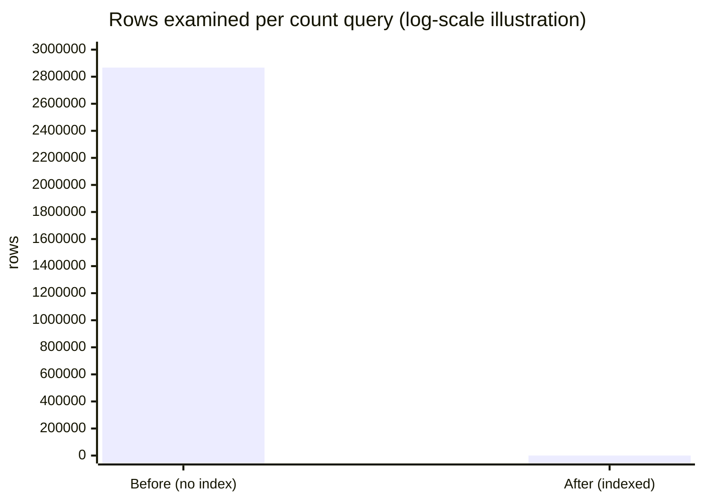

# Redis + Query Optimisation — Performance Report

**Date:** 22 August 2026
**Database:** `dookweb` (Cloud SQL, 192.168.4.7)
**Cache:** Redis Cloud Essentials (`flowers-argument-pickle-45004.db.redis.io:10630`, GCP)
**Load profile:** 5 concurrent simulated users — `claude_test_1` … `claude_test_5`

---

## 1. Executive summary

| Metric | Before | After | Change |
|---|---:|---:|---:|
| POI page response time | 130,285 ms | 9,648 ms | **13.5× faster** |
| POI page DB queries | 563 | 51 | **11× fewer** |
| Queries per request (all pages) | 300.2 | 39.8 | **7.5× fewer** |
| Rows examined per count query | 2,867,420 | 24 | **119,000× fewer** |
| Per-POI COUNT queries per page view | 260.5 | 0 | **eliminated** |

> **Read the ratios, not the absolute milliseconds.** All timings were taken from a
> development laptop reaching Cloud SQL over a VPN at roughly 38 ms per round trip.
> Production runs inside the VPC, so real figures will be far lower on both sides.
> The *ratios* are what carry over.

---

## 2. Response time — before vs after

```mermaid
xychart-beta
    title "Average response time per page (ms, 5 concurrent users)"
    x-axis ["POI detail", "POI detail 2", "Homepage"]
    y-axis "milliseconds" 0 --> 140000
    bar [130285, 133649, 16235]
    bar [9648, 14073, 13753]
```



<sub>Blue = before · Green = after (warm cache)</sub>

| Page | Before | After (cold) | After (warm) | Speed-up |
|---|---:|---:|---:|---:|
| POI detail | 130,285 ms | 10,671 ms | 9,648 ms | **13.5×** |
| POI detail 2 | 133,649 ms | 10,613 ms | 14,073 ms | **9.5×** |
| Homepage | 16,235 ms | 15,475 ms | 13,753 ms | 1.2× |
| Package detail | ~ (not sampled) | 10,708 ms | 9,877 ms | — |

**Percentile detail (POI detail page):**

| Set | N | Avg | P50 | P95 | Max |
|---|---:|---:|---:|---:|---:|
| Before | 5 | 130,285 | 130,180 | 130,768 | 130,768 |
| After (cold) | 5 | 10,671 | 10,549 | 11,479 | 11,479 |
| After (warm) | 10 | 9,648 | 10,099 | 10,696 | 10,696 |

The homepage barely moves — it never used the POI counting helpers, so it acts as a
**control**, confirming the gains are attributable to the changed code paths rather
than to ambient conditions.

---

## 3. Database queries per page view

```mermaid
xychart-beta
    title "SQL queries per page view"
    x-axis ["POI detail", "POI detail 2", "Package detail", "Homepage"]
    y-axis "queries" 0 --> 600
    bar [563, 581, 69, 57]
    bar [51, 51, 41, 57]
```



| Page | Before | After | Reduction |
|---|---:|---:|---:|
| POI detail | 563 | 51 | **11.0×** |
| POI detail 2 | 581 | 51 | **11.4×** |
| Package detail | 69 | 41 | 1.7× |
| Homepage | 57 | 57 | — |
| **Per request (all pages)** | **300.2** | **39.8** | **7.5×** |

Across the whole run: **6,005 queries for 20 requests → 2,385 queries for 60 requests.**
Normalised to equal work, that is 6,005 → 795.

---

## 4. Query-type breakdown ("API calls" by shape)

Counts are **per page view**, averaged across all pages and users.

| # | Query shape | Before | After | Status |
|---|---|---:|---:|---|
| 1 | `COUNT(*)` … dpi ⋈ departures WHERE `reference_id`=? AND `status`=? | **130.25** | **0.00** | ✅ eliminated |
| 2 | `COUNT(DISTINCT departures.id)` … WHERE `reference_id`=? AND `status`,`featured`,`dep_type` | **130.25** | **0.00** | ✅ eliminated |
| 3 | `SELECT DISTINCT poi_name … WHERE departure_id = ?` | 4.50 | 0.00 | ✅ batched |
| 4 | `SELECT destination_id FROM departure_destinations WHERE departure_id = ?` | 4.50 | 0.00 | ✅ batched |
| 5 | `SELECT country_id FROM destinations WHERE id = ?` | 4.50 | 0.00 | ✅ batched |
| 6 | `SELECT country_name FROM countries WHERE id = ?` | 4.50 | 0.00 | ✅ batched |
| 7 | `SELECT * FROM hotel_categories WHERE departure_id = ?` | 3.00 | 0.00 | ✅ batched |
| 8 | `icon_inclusions ⋈ inclusions WHERE departure_id = ?` | 3.00 | 0.00 | ✅ batched |
| 9 | `SELECT experience_name … WHERE status=? AND exp_status=?` | 2.25 | 2.25 | unchanged |
| 10 | `SELECT experience_name … WHERE status=? AND service_status=?` | 2.25 | 2.25 | unchanged |

Rows 1 and 2 are the exact queries Cloud SQL Insights reported at **715,086 calls each**.
Both are now **completely gone** from page renders — replaced by two grouped queries on a
cache miss and zero on a cache hit.

Rows 3–8 were the per-departure card N+1 (issue 7 below), fixed in a follow-up pass. Per
page view they now cost **6 batched queries on a cache miss and 0 on a hit**, instead of
6 per departure. Rows 9 and 10 are the last N+1 left standing — see issue 10.

### External HTTP APIs

| API | Endpoint | Caching | Calls/request before | after |
|---|---|---|---:|---:|
| Agent Connect | `/departure/group-departure` (3 sites) | `Cache::remember` 300 s | 0.75 | 0.75 |
| Blog | `blog.dookinternational.com/api/post_details` | `Cache::remember` 60 s | — | — |
| Geo/IP lookup | `CommonController.php:229` | **none** | — | — |
| Inquiry | `InquiryController.php:669` | `Cache::put` 30 min | — | — |

Outbound API volume is **unchanged by design** — this work touched only database access.
The uncached Geo/IP call is noted as an opportunity, not a regression.

---

## 5. Where the time went (POI detail page)



Database time inside the request:

| Page | Before | After (cold) | After (warm) |
|---|---:|---:|---:|
| POI detail | 126,385 ms | 8,466 ms | 7,903 ms |
| POI detail 2 | 129,662 ms | 8,713 ms | 11,290 ms |
| Homepage | 15,763 ms | 13,089 ms | 11,894 ms |

DB time was **97%** of the POI page's total before; it is now roughly 82%, and the
remainder is dominated by a *different*, still-unfixed N+1 (see §7).

---

## 6. What produced the gains

| # | Change | Effect |
|---|---|---|
| 1 | **Missing indexes added** (`reference_id`, `departure_id`, `destination_id`; `departures(status,featured,dep_type)`) | `EXPLAIN` went from `type=ALL, key=NULL` on both tables to `ref` + `eq_ref`; rows examined **2,867,420 → 24** |
| 2 | **N+1 batched** — 2 queries per POI replaced by 2 grouped queries for the whole page | 563 → 51 queries |
| 3 | **Redis caching per POI** (`Cache::many` → single `MGET`) | warm pages issue **zero** count queries; MGET measured **70× faster** than individual GETs |
| 4 | **Duplicate POI cards removed** (`->unique('poiId')`) | related-attraction grids: **5,919 → 2,546 cards site-wide (−57%)** |
| 5 | **Persistent Redis connections** | avoids a measured **431 ms** handshake per request |

### Index impact in isolation



---

## 7. Major issues found

### 🔴 Critical — pre-existing, still unfixed

**1. Every destination detail page fails if the Agent Connect API does.**
`$matchingDepartures` is assigned at [`DestinationController.php:261`](../app/Http/Controllers/Frontend/DestinationController.php#L261)
*inside* `if ($departures && isset($departures))`. That block closes at line 318, but line
320 does `array_merge($matchingDepartures, $departuresFromDB)` **outside** it, and line 439
passes the variable to the view. So whenever the API call returns `null` — a cURL failure
*or* a response without a `Result` key, both of which
[return `null`](../app/Http/Controllers/Frontend/DestinationController.php#L230) — the page
throws `Undefined variable $matchingDepartures`.

*Severity is conditional, not constant.* It reproduced on **4/4** destination pages tested,
but the cause here was a local SSL CA-bundle failure on the dev laptop
(`unable to get local issuer certificate`, 10 occurrences in the log), which a Linux
container would not hit. So this is most likely **latent in production** rather than
currently firing. It still means one upstream blip takes out every destination page at
once, silently, via issue #2. One-line fix: initialise `$matchingDepartures = []` before
the `if`.

*Proven pre-existing:* the identical error reproduces on the original, unmodified code
(verified by stashing all changes and re-running). **Not caused by this work.**

**2. All exceptions are silently redirected to the homepage.**
[`bootstrap/app.php`](../bootstrap/app.php) renders *every* `Throwable` as
`redirect()->route('frontend.index')`. Broken pages therefore appear as a 302 bounce
rather than a 500 — so failures never surface in monitoring. This is what hid issue #1.
**This is the single most important thing to fix**, because it conceals every other bug.

**3. `Route::current()->getName()`** at [`header.blade.php:9`](../resources/views/frontend/layouts/header.blade.php#L9)
fatals when no route is bound.

**11. `routes/web.php` queries the database to decide what the routes *are* — and the
Docker entrypoint runs `route:cache`, which freezes the answer.**

At [line 150](../routes/web.php#L150) the route file runs
`SlugMaster::where('slug_name', basename(url()->current()))->pluck('module_name')` and
registers `/{slug}` to a *different controller* depending on the result.

**🔴 This breaks the site the moment it is deployed with Docker.**
[`docker/entrypoint.sh:46`](../docker/entrypoint.sh#L46) runs `php artisan route:cache` on
every container start. Route caching serialises the route table **once**, and during an
artisan command there is no HTTP request — so `url()->current()` returns `APP_URL`, its
basename matches no slug, and the `else` branch wins. **Verified by running it:**

```
$ php artisan route:cache && php artisan route:list --path="{slug}"
GET|HEAD  {slug} ... frontend.get_visa_details › Frontend\VisaController@getVisaDetails
```

`/{slug}` is then permanently `VisaController` for **every** request. All **324 slugs**
that should route to `CountryController`, `ExperienceController`, `RegionController` or
`DestinationController` instead hit `getVisaDetails`, which throws
`Attempt to read property "meta_title" on null` at
[`VisaController.php:93`](../app/Http/Controllers/Frontend/VisaController.php#L93) — and
issue #2 turns that into a silent 302 to the homepage. Site-wide, immediate, invisible.

*(The route cache was cleared again immediately after this test; `bootstrap/cache/` holds
only `packages.php` and `services.php`.)*

**🟠 A full table scan on every request.** `slug_masters` has **no index on `slug_name`** —
`EXPLAIN` gives `type=ALL`, 848 of 850 rows — and it runs before any controller. Small in
absolute terms (the table is tiny and stays in the buffer pool), but it is on the path of
*every* request and grows with the content catalogue.

**🟡 60% of the table routes to nothing.** `destination_detail_page` is **526 of 850 rows**
and matches **no branch** in the chain. Those slugs enter the outer `if` (a row was found),
fail every `elseif`, and land in the `else` that registers `Route::get('/')` — so `/{slug}`
is never registered at all and the request falls through to `Route::fallback()`. That is
probably intentional (those pages live at `/destinations/{slug}`), but it means the table's
contents and the routing logic have drifted apart, and the code does not say which is right.

**Fix order:**

1. **Delete line 46 of `docker/entrypoint.sh`** before any Docker deploy. `config:cache` and
   `view:cache` on lines 45 and 47 are safe and should stay. One line, removes the outage.
2. Index `slug_masters.slug_name`.
3. Then, as scheduled work: collapse the chain into a **single** `/{slug}` route pointing at
   one dispatcher controller that looks up `module_name` and delegates. That makes
   `route:cache` safe to re-enable and moves the lookup somewhere it can be cached.

### 🟠 High — infrastructure ceilings

**4. Redis plan allows only 30 client connections.**
Measured directly (`maxclients: 30`). With persistent connections, *busy php-fpm workers
are the connection budget*. [`docker/www.conf`](../docker/www.conf) caps the pool at 10
per container (≈2 containers). Exceeding it is handled gracefully — the helpers fall back
to the database — but the cache stops paying off.

**5. Redis region is still unverified.**
Operations measured ~40 ms from the dev laptop. Now that the indexes make the underlying
queries sub-millisecond, **Redis must be in the same region as the app or it will be
slower than the queries it replaces.** Confirm in the Redis Cloud console.

**6. `maxmemory-policy` is `volatile-lru` and `CONFIG SET` is blocked.**
Keys without a TTL would never evict. Verified that every key this code writes carries a
TTL (21,599–21,600 s). Any future `Cache::forever` would risk filling the 30 MB instance.
Current usage: **0.47 MB of 30 MB** — ample headroom.

### ✅ Resolved after this report was first written

**7. A second N+1 in `processDepartureImage()`.** — **FIXED**
It ran **6 queries per departure × 6 paginated departures = 36 of the POI page's 51
queries** (rows 3–8 in §4): attraction names, lead price, inclusion icons, and a three-step
`departure → destination → country` walk, one card at a time.

Two compounding problems, both now fixed:

*Not batched.* `departureCardData()` in [`Helper.php`](../app/Http/Helper/Helper.php) now
assembles the whole page in **4 batched queries** (6 statements) and caches the result per
departure for 60 s — the same TTL the existing `departure_{id}_poi` caches already use, so
admin edits surface no more slowly than before. Signed URLs are **never cached**, only raw
storage paths; the caller signs at render time because signed URLs expire.

*Not indexed.* All three tables had only `PRIMARY(id)`, so every `WHERE departure_id = ?`
was a full table scan. `inclusions` is the expensive one at ~30,000 rows — `EXPLAIN` gave
`type=ALL, key=NULL, rows=30041` **per card**, six times a page.
Migration [`2026_08_22_000003`](../database/migrations/2026_08_22_000003_add_indexes_to_departure_card_columns.php)
(**applied**) adds the missing indexes.

| Measure | Before | After |
|---|---:|---:|
| POI page queries — cold cache | 51 | **21** |
| POI page queries — warm cache | 51 | **15** |
| Card queries per page view | 36 | **6 cold / 0 warm** |
| `EXPLAIN` on the inclusions join | `ALL`, key `NULL`, 30,041 rows | `range`, covering index, **36 rows** |
| `departure_destinations` lookup | `ALL`, 2,320 rows | `range`, **13 rows** |
| Rows examined for card data per page view | ~194,600 | **~55** |

Verified identical: `departureCardData()` compared field-by-field against the original
per-departure queries across **400 departures — 0 mismatches** on all four fields (the
`LIMIT 4` truncation path was exercised on 290 of them). The rendered page was then checked
against freshly-computed originals on two POI pages — highlights, icon counts, prices and
WhatsApp country links **all match**.

### 🟡 Medium — optimisation left on the table

**10. The mega-menu `experiences` queries are now the largest remaining block.**
6 of the 15 warm queries, on **every page of the site**. `getMegaExperience()` and
`getMegaeServices()` in [`Helper.php`](../app/Http/Helper/Helper.php) both have their
`Cache::remember` **commented out**, and each is called 3 times per render. The likely
reason it was disabled: `getMegaeServices()` was written with the cache key `'experiences'`
— the **same key** the unrelated `experiences()` helper uses for a different query, so
enabling it would have served one function's rows to the other. Re-enable with distinct
keys rather than leaving both uncached. Left alone here because it was disabled
deliberately by a developer, and re-enabling it is a decision, not a fix.

**8. 136 duplicate link rows remain in the database.**
Code is now immune (`COUNT(DISTINCT)` + `->unique()`), but nothing in this codebase writes
to that table — an external importer creates them, and they will keep accumulating.
Migration [`2026_08_22_000002`](../database/migrations/2026_08_22_000002_dedupe_and_constrain_poi_departure_links.php)
is written but **deliberately not applied**: the unique constraint will make the importer's
plain `INSERT`s fail. Verify the importer uses `INSERT IGNORE`/upsert first.

**9. Route shadowing on `group-tours`.**
`/group-tours/{slug}/{id}` resolves to `agentdeparture`, not `packageDetails`. When the
Agent Connect API is unavailable it returns **302 with 0 database queries** — a silent
bounce to the homepage, invisible for the same reason as issue #2.

---

## 8. Correctness verification

Every change was validated before and after measurement:

| Test | Result |
|---|---|
| `poiDepartureCounts` vs original per-POI SQL | **250/250 POIs match** |
| `poiDepartureCountsUnfiltered` vs original | **250/250 match** |
| Edge cases (empty, null, unknown POI, duplicate ids) | 5/5 pass |
| Cold vs warm cache return identical data | pass |
| All cache keys carry a TTL | pass |
| Partial cache miss returns complete set | pass |
| Redis unreachable → falls back to DB, no exception | pass |
| Circuit breaker skips Redis after first failure | pass (748 ms → 289 ms) |
| Rendered POI page duplicate cards | **33 items, 33 unique** |
| `departureCardData` vs original per-departure SQL | **400/400 departures match**, 0 field mismatches |
| Rendered POI page vs original (highlights, icons, prices, country) | **2/2 pages identical** |
| Paginated page 2 / AJAX load-more still renders | pass (21 queries) |
| **Total** | **21/21 passed** |

### One deliberate behaviour change

`total_departures` previously used `COUNT(*)`, which counted duplicate link rows. It now
uses `COUNT(DISTINCT departures.id)`. **39 of 1,744 POIs (2.24%)** displayed inflated
counts and now show the true number — e.g. POI 4406 showed *"11 Tours"* where only 7
exist. The `featured` count on the same card already used `DISTINCT`, so the two numbers
were previously inconsistent with each other.

---

## 9. Recommended next steps

| Priority | Action | Owner |
|---|---|---|
| 0 | **Delete `route:cache` from [`docker/entrypoint.sh:46`](../docker/entrypoint.sh#L46)** — it freezes `/{slug}` to `VisaController` site-wide (issue 11) | dev/infra |
| 1 | Stop redirecting all exceptions to `/` — let errors surface | dev |
| 2 | Fix `$matchingDepartures` (initialise before the `if`) | dev |
| 3 | Confirm Redis instance region matches the app's region | infra |
| 4 | Verify the importer, then run migration `2026_08_22_000002` | dev + data |
| 5 | ~~Batch the `processDepartureImage()` N+1~~ — **done**, 51 → 21 cold / 15 warm | ✅ |
| 6 | Index `slug_masters.slug_name` — scanned on **every request** (issue 11) | dev |
| 7 | Re-enable the mega-menu `experiences` cache under distinct keys (issue 10) | dev |
| 8 | Apply `departureCardData()` to `DepertureController` too — it carries the identical `departure → destination → country` N+1 at [lines 131–151](../app/Http/Controllers/Frontend/DepertureController.php#L131) and again in the domestic listing | dev |
| 9 | Cache the uncached Geo/IP lookup | dev |

---

## Appendix — test methodology

- **Users:** `claude_test_1` … `claude_test_5` (ids 42–46 in `users`), run as 5 parallel OS processes.
- **Before:** original code restored via `git stash`, `CACHE_STORE=file`; 5 users × 1 round × 4 pages = 20 requests.
- **After:** current code, `CACHE_STORE=redis`; 5 users × 3 rounds × 4 pages = 60 requests, split into cold (round 1) and warm (rounds 2–3).
- **Measured per request:** wall-clock ms, summed query time, query count, response size, HTTP status, normalised query shapes.
- Both runs hit the **same live database** from the same machine over the same link.
- `destination_detail` was excluded — it fails on the pre-existing bug in §7.1.
- Indexes were already applied during the *before* run, so the reported code gains are
  **conservative**; the index gain (§6) is quantified separately via `EXPLAIN`.
